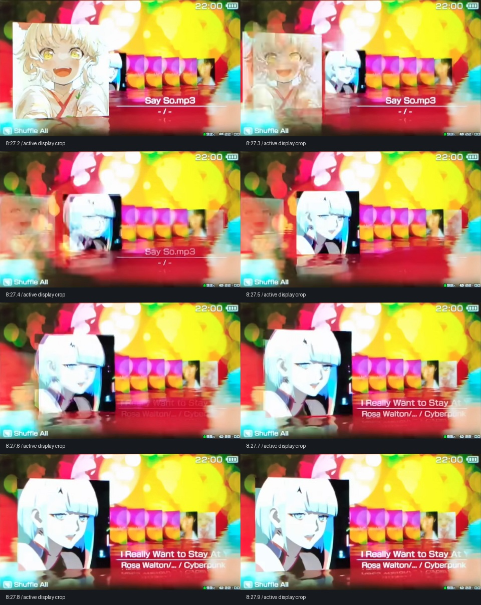

# 用户指定视频的场景观察

参考：[B2-66ER，PSP SensMe 实机教程](https://www.bilibili.com/video/BV12qcnewEhZ/)，2025-01-11 发布。用户于 2026-09-07 指定从约 8 分钟开始对照。该视频优先于早期仅凭静态图片的动画推测。

已取得公开可播放的视频用于本地分析，1280×720、30 fps；视频文件没有加入项目或发布资源。下图为研究用的少量选帧，原视频与歌曲封面版权归各自权利人，不用于运行时贴图。

选帧已按下述屏幕四角求解八参数透视映射，每帧转换至 480×272，便于与实际 Three.js 相机投影比较。整组使用同一个屏幕四边形，拍摄过程中残留的轻微相机移动没有被当作封面动画补偿；边界测量需容忍数个像素误差。

## 明确可观察的动作

- 8:27.2 仍为前一首的稳定布局；8:27.3 已开始向左缩小、透明化。
- 后排第一张同时向左前方放大，没有额外上下弹跳或抛物线抬升。
- 8:27.6 前一首基本消失；8:27.8 新封面约完成 97% 的位移，8:27.9 收敛至稳定姿态。显著运动约 0.6 秒，随后约 0.1 秒尾段；实现总时长约 0.7 秒。退出主要发生在前约 0.4 秒。
- 稳定封面没有周期性的上下浮动。拍摄中 PSP 和相机本身有移动，不能把整个屏幕的移动当成封面漂浮。
- 反射比封面显著柔软，离接触边越远越扩散；波纹扭曲不能替代模糊。
- 后排顶部逐渐降低、底部逐渐升高，封面向右递减，并非同尺寸横排。

## 构图测量依据

8:27 的原始视频画面中，主封面约 (278,185) 至 (608,518)。第一张后排露出约 x608–665、y292–422；后续露出范围约 x665–728、x728–786、x786–846、x846–905、x905–962，顶部依次约 y298、304、307、311、312，底部约 y416、413、408、403、401。

初次使用的屏幕四角 (226,102)、(1057,108)、(1052,582)、(232,584) 包含了屏幕外围黑边。重新查看原片后，实际发光区域的四角修正为约 (234,110)、(1050,113)、(1048,573)、(236,577)。上方联系表使用修正后的四角；旧裁切保留在 `references/bilibili-transition.jpg` 以便审计。原版参数预测的稳定封面约 (26,43)–(219,237)，与修正后首帧相符；不能反过来移动裁切点以强行拟合原版参数。

这些数值来自实机拍摄的可见边界，包含镜头透视、屏幕倾斜、遮挡和有损视频误差。它们适合修正队列构图，不等同于原始 PSP 帧缓冲坐标；被前方封面遮住的部分不可直接量测。时序来自 0.1 秒间隔选帧，约有一至数帧不确定性。

## 用户要求

取消封面上下缓动；离开动画向左渐隐并略微缩小；加强水面模糊；校准后续歌曲封面排布。核心实现继续由 Astra 完成，以上观察用于限定实现而非以旧实现反推结论。

## 视频中的 Shuffle All 环境

8 分钟后的场景并非 Energetic 蓝天彩虹，而是彩色散景。可见区域左上偏暗绿与黑，左中有红色和洋红色斑块，中上部出现白色亮斑，右上以大面积黄、橙色光斑为主，右下和左下可见青色；水面也延续这些背景颜色。大小不同的光斑互相遮叠，边缘兼有柔焦和较清晰的轮廓。

该环境作为单独可选的视觉场景复建，保留 Energetic。初版使用 GLSL 程序图案；2026-09-08 已换为从原版 bg.gim 解码的背景帧，不使用视频截图。来源见 credits.md。原版背景裁切、运动及精确相位仍待核对。

## 初版逐帧轨迹核对（含黑边的旧裁切）

以下记录初版几何对旧裁切标注的拟合结果，保留为历史，不作为原版参数整合后的精度结论。首帧左边被前封面遮挡，不能直接量测，依据露出的方形轮廓推定。其余边界仍允许约 2–4 像素的拍摄和压缩误差。

| 时刻 | 参考边界 (left, top, right, bottom) | Three.js 投影 | 四边 RMS 误差 |
|---|---|---|---:|
| 8:27.2 | (179,106,252,180) | (179,106,252,180) | 0.44 px |
| 8:27.3 | (168,100,250,184) | (168,101,249,184) | 0.76 px |
| 8:27.4 | (128,86,244,198) | (128,86,241,198) | 1.73 px |
| 8:27.5 | (111,80,238,205) | (111,79,237,204) | 0.87 px |
| 8:27.6 | (72,65,230,218) | (74,64,229,219) | 1.25 px |
| 8:27.7 | (49,56,224,225) | (50,55,224,228) | 1.90 px |
| 8:27.8 | (36,51,220,231) | (38,50,221,233) | 1.70 px |
| 8:27.9 | (30,49,218,233) | (31,47,220,236) | 2.09 px |

对应世界空间插值进度为约 `[0, .11, .44, .56, .79, .91, .97, 1]`，采用无过冲的单调 Hermite 插值。RMS 使用未取整投影计算，仅用于检查实现是否落在观测误差范围内，不代表原片具有亚像素精度。稳定主封面由旧边界 `(23,48)–(220,244)` 调整为约 `(31,47)–(220,236)`。

离场不能继续采用慢起步的通用三次缓入缓出。参考 8:27.3 的旧封面右缘约 x165、可见高度约为稳定高度的 85%；8:27.4 右缘约 x102。实现于离场 0.1 秒达到约 85% 尺寸、右缘 x165，0.2 秒达到约 82.5% 尺寸、右缘 x102。底边保持水线锚定，未为了强行吻合模糊的摄影上下边界另加垂直漂移；透明度为近似视觉拟合，而非原始 alpha 的测量。

当前复核命令：`node src/scene/verify-reference.mjs`。该检查随当前场景参数更新，并检查插值单调性、连续中断后的路径和手机视口完整性；不代替浏览器中的最终视觉验收。

## 实际发光区域下的标注转换

将旧标注经过“旧屏幕坐标 → 原视频像素 → 新屏幕坐标”的两次单应映射，可得到下面的近似边界。这是同一批标注的坐标转换，未增加测量精度；仍不消除拍摄过程中的 PSP 微小移动。首帧左边仍受遮挡。

| 时刻 | 新裁切边界 (left, top, right, bottom) |
|---|---|
| 8:27.2 | (178,106,252,182) |
| 8:27.3 | (167,100,250,187) |
| 8:27.4 | (126,85,244,201) |
| 8:27.5 | (109,79,238,208) |
| 8:27.6 | (69,63,230,221) |
| 8:27.7 | (46,54,224,229) |
| 8:27.8 | (32,48,220,235) |
| 8:27.9 | (26,46,218,237) |

另已取得原版 1.50 明文参数，详情见 [original-package.md](original-package.md)。原版数据、其坐标语义的重建与视频中的测量值分别记录，避免将拟合当作原始代码。
